# aws-serverless-datapipeline

This project demonstrates a serverless data pipeline on AWS that ingests healthcare data, processes it with Glue, stores the processed dataset in S3, enables SQL-based analytics with Athena, and builds dashboards in QuickSight.

It also includes EventBridge + SNS for job notifications and CloudWatch for monitoring.

📌 Architecture Diagram 

Workflow:

S3 (Raw Data Source) → Healthcare dataset uploaded (CSV/JSON).

Lambda (Trigger) → Automatically detects new uploads and triggers the Glue ETL job.

Glue (ETL) → Cleans & transforms raw data, saves processed data back to S3.

Glue Data Catalog → Schema registered for Athena queries.

Athena (Query Engine) → Queries processed dataset with SQL.

QuickSight (Visualization) → Creates dashboards and reports from Athena.

EventBridge (Event Tracking) → Tracks Glue job state changes (success/failure).

SNS (Notification Service) → Sends email alerts on Glue job completion/failure.

CloudWatch (Monitoring) → Provides logs and metrics for Lambda & Glue.

✨ Key Features

Fully serverless data pipeline → no servers to manage.

Event-driven architecture → automatic trigger on file upload.

ETL with AWS Glue → transform raw healthcare data into clean datasets.

SQL analytics via Athena → flexible queries on processed data.

QuickSight dashboards → visual insights on patient and healthcare metrics.

Job tracking + alerts → EventBridge + SNS for real-time notifications.

Monitoring & troubleshooting → CloudWatch logs and metrics.

🛠️ Tech Stack

AWS Services: S3, Lambda, Glue, Glue Data Catalog, Athena, QuickSight, EventBridge, SNS, CloudWatch

Language: Python (Lambda + Glue Scripts)

Data Format: Raw CSV → Processed CSV/Parquet (optimized for Athena)

🚀 Setup Guide

S3 → Create a bucket and upload sample healthcare dataset.

Lambda → Deploy function (/src/lambda/) to trigger Glue.

Glue → Run ETL job (/src/glue-job/) → output cleaned data to S3.

Glue Crawler → Build schema in Glue Data Catalog.

Athena → Query processed data using SQL.

QuickSight → Connect to Athena, build dashboards.

EventBridge → Rule to track Glue job state.

SNS → Topic to send email notifications on Glue job completion/failure.

CloudWatch → Monitor pipeline execution and logs.

Images of the analysis done on Quicksight:

